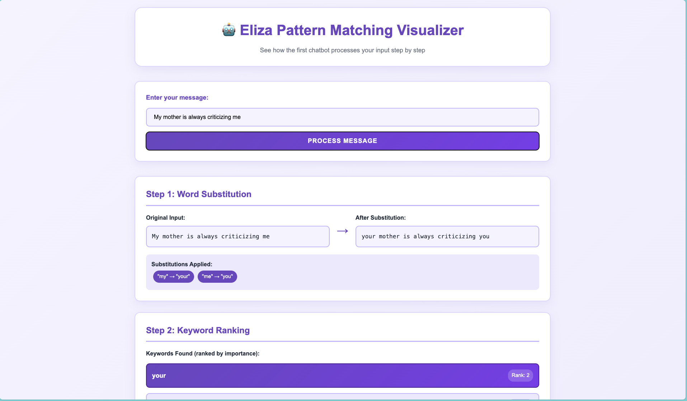

# eliza.py
**ELIZA** is a natural language processing program developed from 1964 to 1966 by Joseph Weizenbaum, 
originally implemented in MAD-SLIP. 
You can read the 1966 paper [here](https://dl.acm.org/doi/10.1145/365153.365168). 

ELIZA uses pattern matching, decomposition and reassembly rules 
to emulate a Rogerian psychotherapist.


(Inputs taken from [Weizenbaum's 1966 paper, pp.1-2.](https://dl.acm.org/doi/10.1145/365153.365168))

# Eliza Pattern Matching Visualizer 

This repo also contains a demo pattern matching vizualizer that you can find here: [visualizer website](https://marlenezw.github.io/eliza/demo/). Take a look at how the response is generated using substitution, rules and regex! 




# Download
## Requirements
- Python 3.x 
(should work with Python 2 by adjusting back the syntax of some commands)

## Via command-line
```bash
# Clone the repository
$ git clone https://github.com/rdimaio/eliza-py
```

# Usage
## Starting the program
```bash
# Go into the project folder
$ cd eliza-py

# Execute the file
$ python eliza.py
Eliza: Hi.
You: [type something]
```

## Example conversation (using the same inputs as the original paper, pp. 1-2)
```
You: Men are all alike.
Eliza: In what way?
You: They're always bugging us about something or other.
Eliza: Can you think of a specific example?
You: Well, my boyfriend made me come here.
Eliza: Your boyfriend made you come here?
You: He says I'm depressed much of the time.
Eliza: I am sorry to hear that you are depressed.
You: It's true. I am unhappy.
Eliza: Do you think coming here will help you not to be unhappy?
You: I need some help, that much seems certain.
Eliza: What would it mean to you if you got some help?
You: Perhaps I could learn to get along with my mother.
Eliza: Tell me more about your family.
```

## Exiting the program
```bash
# You can type bye, goodbye, done, quit or exit. Or use CTRL+C, if you want to be rude about it...
You: bye
Eliza: Goodbye.
```

Learn more about Eliza at the original project here: https://github.com/rdimaio/eliza-py
